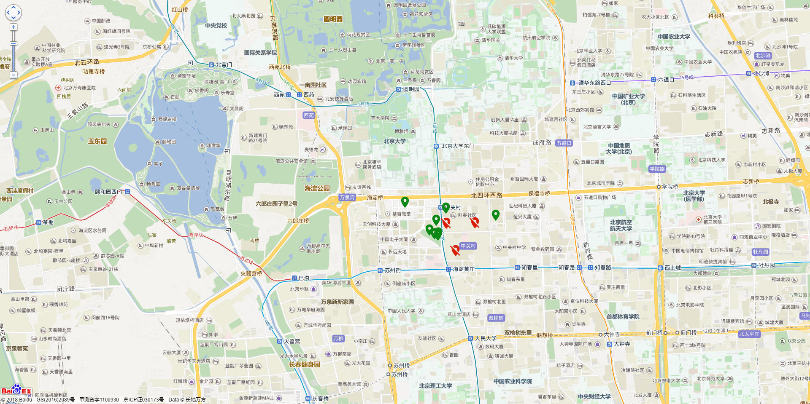
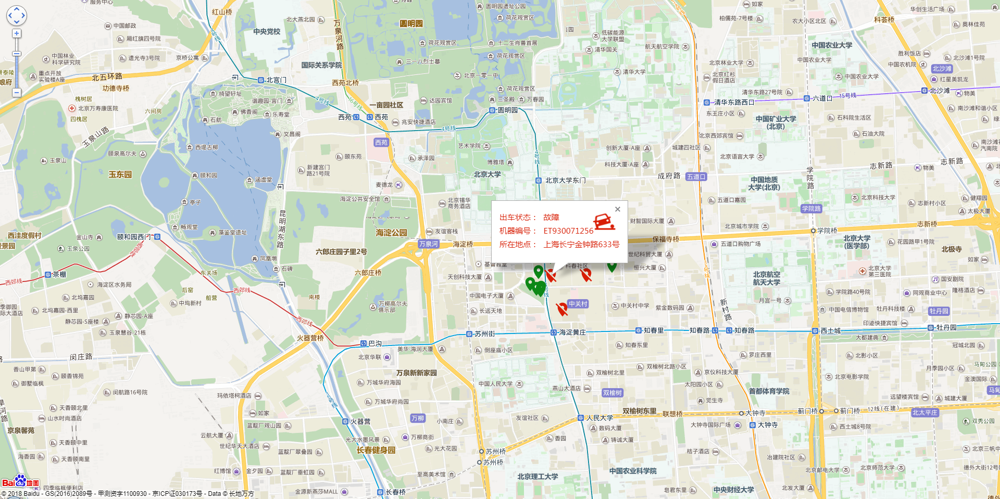
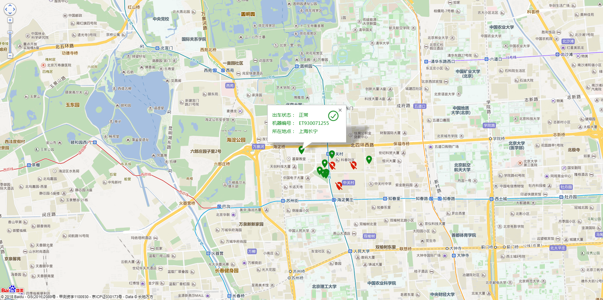
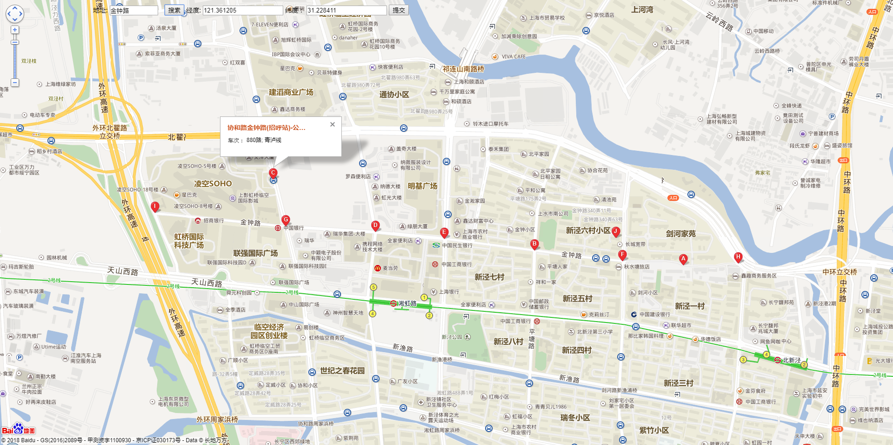
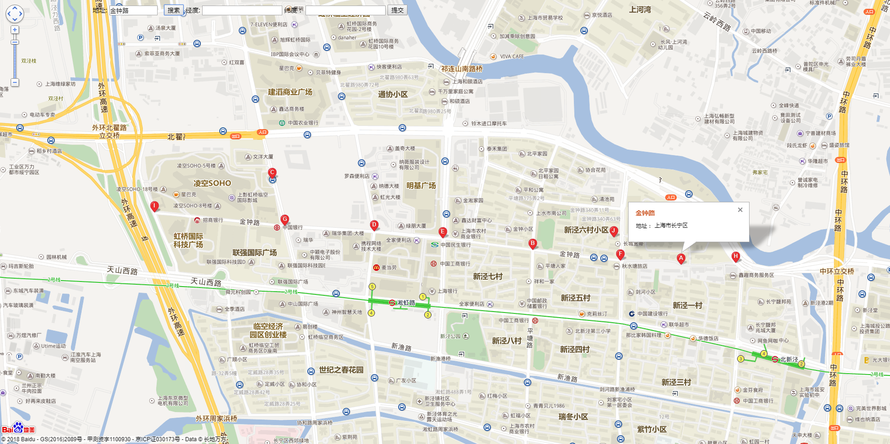
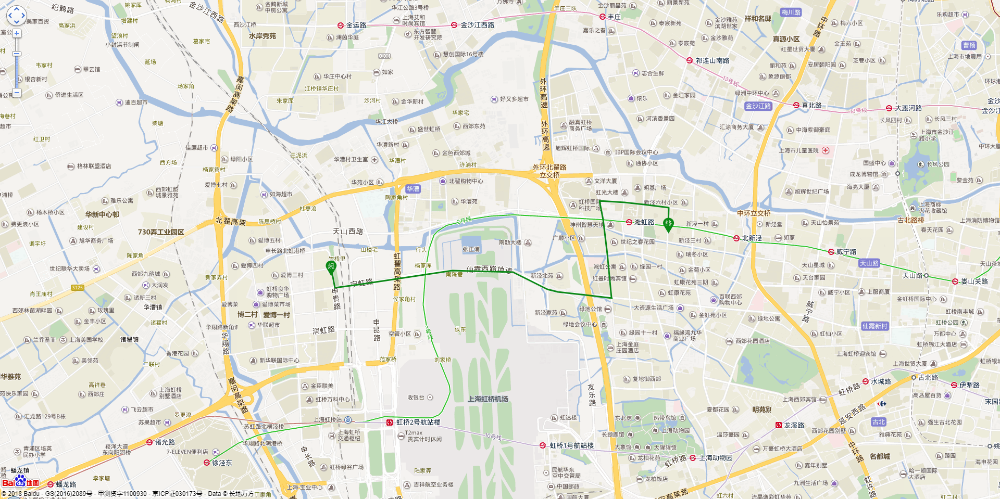
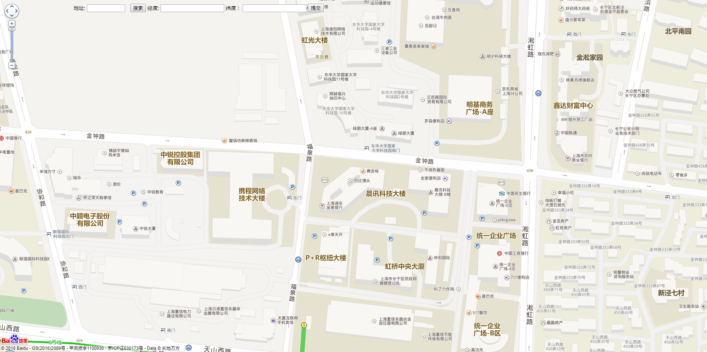

# 百度地图api实现运动轨迹、坐标拾取、多点标注并显示信息窗体
------------------------

#### 平台页面功能说明
------------------------
> 1. 获取多个坐标点标注在地图上
> 2. 根据不同状态显示不同的信息窗口样式
> 3. 根据地址检索坐标点（可显示多个）
> 4. 鼠标点击抓取坐标
> 5. 运动轨迹（标记起始位置和终点位置）

#### 页面演示
------------------------

多个标注点

多个标注点故障
  

拾取坐标

搜索标注点

运动轨迹

坐标拾取

#### 项目源码地址：
------------------------

码云地址：https://gitee.com/ldhblog/Bmap.git
